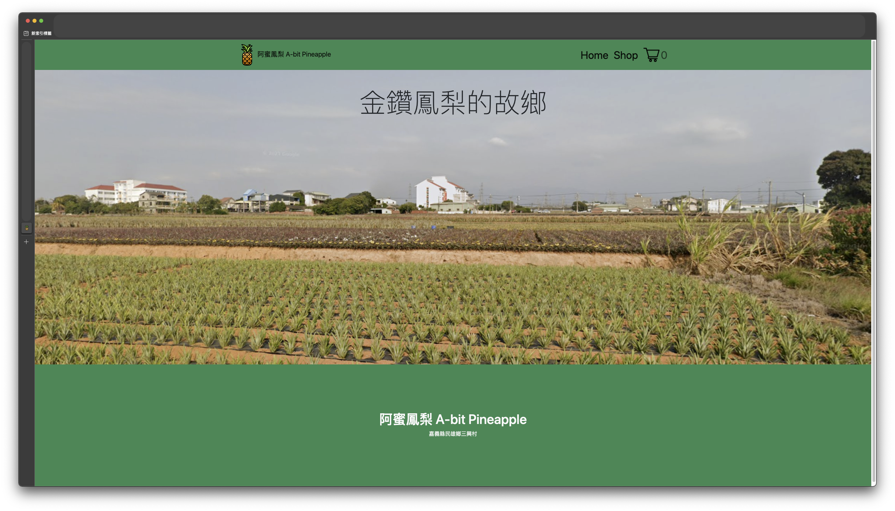

# 我家的鳳梨網站 My Family's Pineapple #

用來練習 `react.js` 的 `useState` 跟 `useEffect`

有些 props 傳太多層，會再研究 `useContext` 或是 `Redux` 來改善

目前尚未串接資料庫

[點這邊前往頁面](https://yoyutw.github.io/shopping-cart/)

## Result

